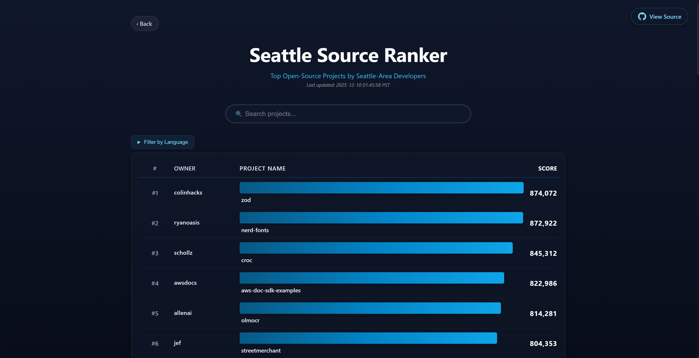

# Seattle Source Ranker

[](https://github.com/thomas0829/Seattle-Source-Ranker/releases/tag/v1.0.0)
[](https://github.com/thomas0829/Seattle-Source-Ranker/actions)
[](https://www.python.org/downloads/)
[](https://opensource.org/licenses/Apache-2.0)

> **Discover and rank Seattle's top GitHub projects and open source repositories**



A comprehensive system that collects, validates, and ranks open source projects from Seattle-based GitHub users. Features three-stage API collection strategy, intelligent multi-factor scoring, secondary validation workflow, distributed processing with Celery/Redis, PyPI integration, and automated weekly updates via GitHub Actions.

**Live Website**: [https://thomas0829.github.io/Seattle-Source-Ranker/](https://thomas0829.github.io/Seattle-Source-Ranker/)

---

## Latest Statistics

- **447,349 projects** tracked across Seattle's developer community
- **2,915,388 total stars** accumulated by Seattle projects
- **28,760 users** collected in latest run
- **1,157 Python projects** published on PyPI (2.00% of Python projects)
- **28 Python projects** in global Top 15,000 PyPI packages (0.07% of Python projects)
- Last updated: 2026-05-11 03:35:43 PDT

---

## Use Cases

### For Developers
- **Discover Quality Projects**: Find high-quality Seattle-based open source projects to learn from and contribute to
- **Find Libraries & Tools**: Search for well-maintained local packages and tools to integrate into your projects
- **Track Technology Trends**: Explore what technologies and frameworks are trending in Seattle's tech community
- **Network & Collaborate**: Identify active maintainers and projects aligned with your interests

### For Recruiters & Companies
- **Talent Discovery**: Find skilled developers based on their open source contributions and project quality
- **Evaluate Technical Skills**: Assess a developer's expertise through their project portfolio and activity metrics
- **Market Research**: Understand the local tech landscape and identify companies with strong open source presence
- **Community Insights**: Track emerging technologies and popular frameworks in Seattle's developer ecosystem

---

## Key Features

- **Three-Stage API Collection** - GraphQL user discovery → REST repo data → GraphQL validation
- **Secondary Validation** - Removes ~2% invalid repos, fixes incorrect watchers count
- **Distributed Processing** - 16 parallel tasks via Celery workers for efficient collection
- **Multi-Token Support** - Intelligent rotation system (6 tokens recommended)
- **Multi-Factor Scoring** - SSR algorithm balancing popularity, quality, and maintenance
- **PyPI Integration** - Python project detection with tiered bonus scoring
- **Interactive Web UI** - React-based with real-time search and smooth pagination
- **Weekly Auto-Updates** - Automated collection and deployment via GitHub Actions
- **10 Languages Supported** - Separate rankings for major programming languages

---

## Quick Start

### Installation

```bash
# Clone and install
git clone https://github.com/thomas0829/Seattle-Source-Ranker.git
cd Seattle-Source-Ranker
pip install -e .
```

## Usage

The package can be imported and used as a Python library:

```python
from seattle_source_ranker.tokens import TokenManager
from seattle_source_ranker.pypi import PyPIChecker
from seattle_source_ranker.scoring import calculate_ssr_score

# Load GitHub tokens
token_mgr = TokenManager()
token = token_mgr.get_best_token()

# Check if a project is on PyPI
checker = PyPIChecker()
result = checker.check_project("requests", "requests")
print(f"On PyPI: {result.on_pypi}")

# Calculate SSR score for a project
score = calculate_ssr_score(
    stars=5000,
    forks=1000,
    watchers=500,
    created_at="2015-01-01",
    pushed_at="2024-12-01",
    open_issues=50
)
print(f"SSR Score: {score:,.2f}")
```

For more details, see the [source code](src/seattle_source_ranker/) and [documentation](docs/).

---

## Running Data Collection

### Quick Start (Recommended)

```bash
./run_local.sh
```

Runs the complete pipeline automatically - from data collection to frontend deployment.

**Prerequisites:**
- Python 3.11+
- Redis server
- 6 GitHub tokens in `.env.tokens` ([setup guide](docs/MULTI_TOKEN_GUIDE.md))

### Manual Execution

For step-by-step control:

```bash
# 1. Install dependencies
conda env create -f environment.yml && conda activate ssr
# OR: pip install -e .

# 2. Configure tokens (see docs/MULTI_TOKEN_GUIDE.md)
# Edit .env.tokens with your GitHub tokens

# 3. Start Redis
redis-server --daemonize yes

# 4. Run collection (~60-90 min)
python main.py --max-users 30000 --workers 8

# 5. Secondary validation (~45 min)
bash scripts/start_workers.sh
python scripts/secondary_update.py
bash scripts/stop_workers.sh

# 6. PyPI integration
python scripts/update_pypi_official_index.py
python scripts/generate_pypi_projects.py
python scripts/update_top_pypi_packages.py

# 7. Generate frontend
python scripts/generate_frontend_data.py
python scripts/update_readme.py

# 8. Start dev server
cd frontend && npm start
```

---

## SSR Scoring Algorithm

Projects are ranked using a comprehensive multi-factor scoring system that balances popularity with quality and maintenance signals.

### Base Popularity Metrics (70%)
```
Stars    × 40%  - Primary popularity indicator
Forks    × 20%  - Engagement and derivative work
Watchers × 10%  - Ongoing interest and monitoring
```

### Quality Factors (30%)
```
Age      × 10%  - Project maturity (peak at 3-5 years)
Activity × 10%  - Recent maintenance (last push time)
Health   × 10%  - Issue management (issues relative to popularity)
```

### Scoring Formula
```
Score = (
    log₁₀(stars + 1) / log₁₀(100000) × 0.40 +
    log₁₀(forks + 1) / log₁₀(10000) × 0.20 +
    log₁₀(watchers + 1) / log₁₀(10000) × 0.10 +
    age_factor() × 0.10 +
    activity_factor() × 0.10 +
    health_factor() × 0.10
) × 1000000
```

### Python Projects: Tiered PyPI Bonuses

Python projects published on PyPI receive tiered scoring enhancements:

```
Base Score Range: 0-1,000,000 points

Tier 1 - Any PyPI Package:           Base Score × 1.05
Tier 2 - Top 15K Global PyPI:        Base Score × 1.05 × 1.10 = × 1.155

Examples:
  Not on PyPI:       756,000 points → 756,000 final
  Regular PyPI:      756,000 points → 793,800 final (+5%)
  Top 15K PyPI:      756,000 points → 873,180 final (+15.5%)
```

**Tier 1 - Any PyPI (5% bonus):**
- Applies to ~1K packages (~2.7% of Python projects)
- **Distribution Commitment** - Package is ready for `pip install`
- **Ecosystem Integration** - Can be used as a dependency in other projects

**Tier 2 - Top 15K Global (additional 10% bonus):**
- Applies to ~30 packages (~0.07% of Python projects)
- **Global Impact** - Millions of downloads worldwide
- **Production Scale** - Among most-used Python packages
- **Combined bonus**: ×1.155 total (+15.5%)

The tiered system rewards both PyPI publication and global ecosystem impact while maintaining fairness to development-focused repositories.

### Why This Approach?

- **Logarithmic Scaling** - Better distribution across projects of different sizes
- **Age Maturity** - Rewards established projects (2-8 years), penalizes too new/old
- **Recent Activity** - Prefers actively maintained projects
- **Health Metrics** - Considers issue management quality relative to popularity
- **Tiered PyPI Bonuses** - Recognizes both production-ready and globally-impactful Python packages
- **Backend Calculation** - All scoring done in backend, frontend displays final scores

Projects are ranked both **overall** and **by programming language** (10 major categories: JavaScript, Python, HTML, Java, TypeScript, C#, Ruby, CSS, C++, Jupyter Notebook).

For detailed factor calculations and examples, visit the [Scoring Methodology](https://thomas0829.github.io/Seattle-Source-Ranker/scoring) page on the live website.

---

## Troubleshooting

Having issues? Check the **[Troubleshooting Guide](docs/TROUBLESHOOTING.md)** for:
- Common errors and solutions (Redis, rate limits, collection failures)
- Frontend build issues
- Frequently Asked Questions (watchers, tokens, file management)

---

## Documentation

- **[Troubleshooting Guide](docs/TROUBLESHOOTING.md)** - Common issues, solutions, and FAQs
- **[Multi-Token Setup](docs/MULTI_TOKEN_GUIDE.md)** - GitHub token configuration and optimization
- **[Changelog](CHANGELOG.md)** - Version history and release notes
- **[Contributing](CONTRIBUTING.md)** - How to contribute to this project

---

## License

This project is licensed under the **MIT License** - see the [LICENSE](LICENSE) file for details.

---

## Acknowledgments

- **GitHub API** (GraphQL v4 + REST v3) for comprehensive data access
- **PyPI API** for Python package ecosystem data
- **Top 15K PyPI packages ranking** from [hugovk/top-pypi-packages](https://hugovk.github.io/top-pypi-packages/)
- **Seattle's developer community** for creating amazing open source projects
- **Celery & Redis** for enabling distributed processing and task queuing
- **React** for powering the interactive web interface
- **GitHub Actions** for automated weekly workflows and deployment

---

<div align="center">

**Seattle Source Ranker 1.0.0** - Production-ready ranking system with advanced search and PyPI integration

*Statistics automatically updated weekly by GitHub Actions every Monday at midnight Seattle time.*

Made with love for Seattle's tech community

</div>
